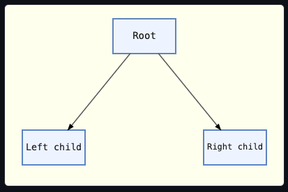
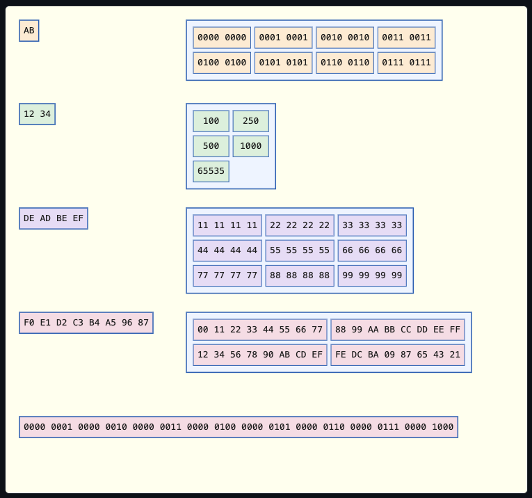
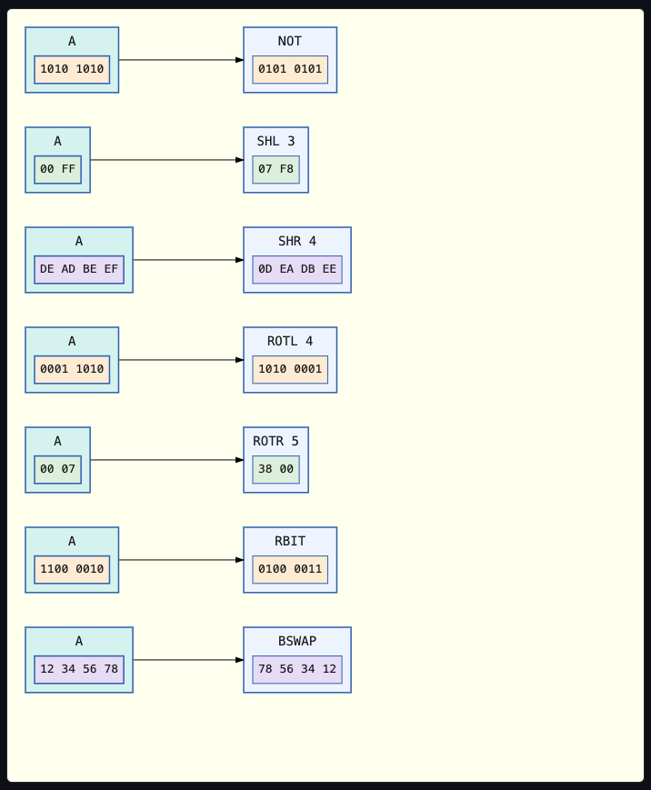
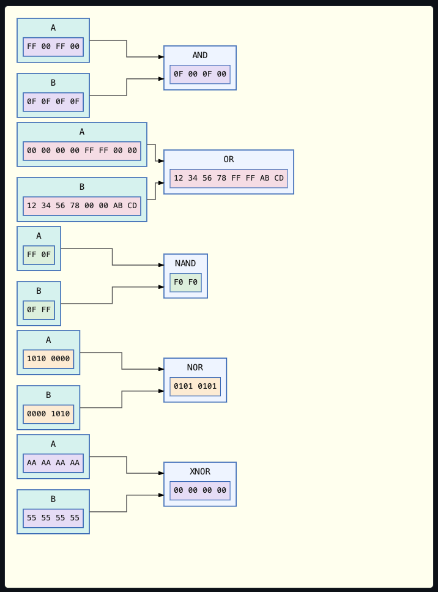
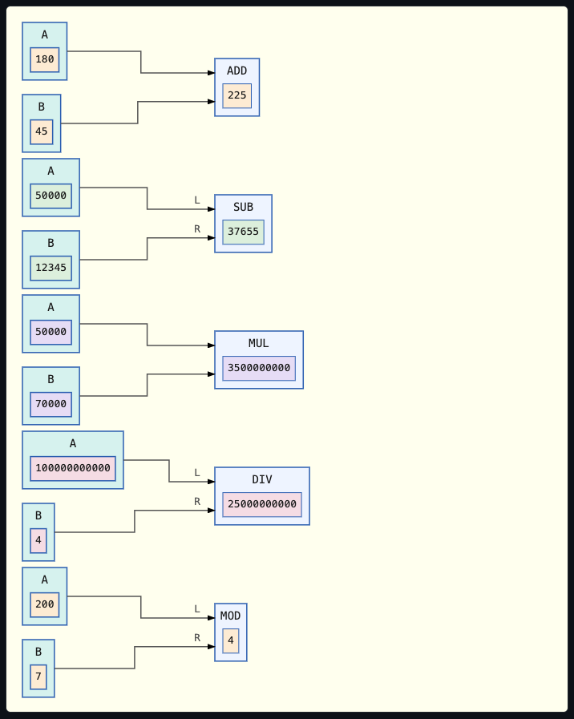
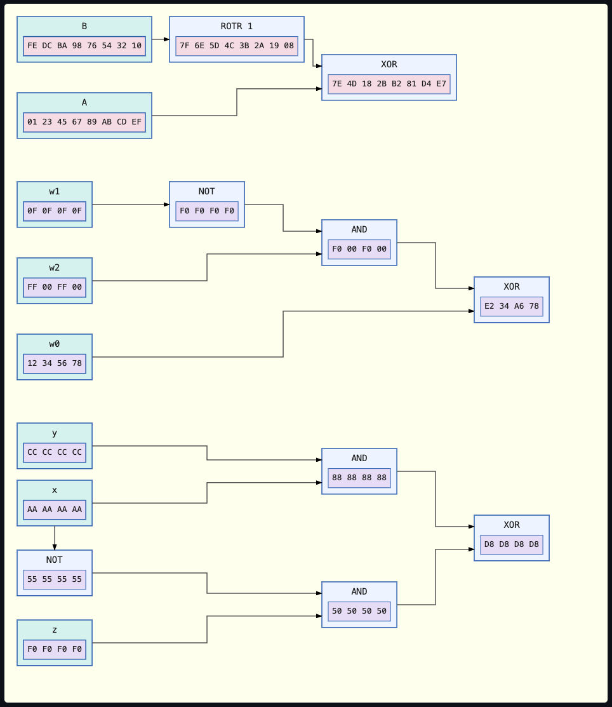
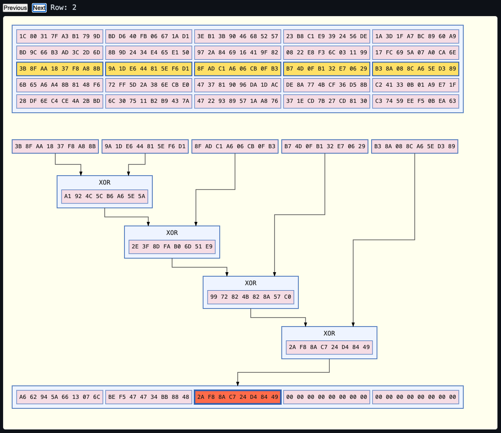

# Demo Scope

## Table of Contents

- [Directed Tree](#directed-tree)
- [Connector Routing](#connector-routing)
- [Fixing points](#fixing-points)
- [Data Node](#data-node)
- [Operator Nodes](#operator-nodes)
  - [Unary Operators](#unary-operators)
  - [Binary Operators](#binary-operators)
  - [Arithmetic Operators](#arithmetic-operators)
  - [Chained Operators](#chained-operators)
- [Cell Selection](#cell-selection)
  - [One-Dimensional Array](#one-dimensional-array)
  - [Two-Dimensional Array](#two-dimensional-array)
  - [Selecting Rows Values to Supply Into an Operator Chain](#selecting-rows-values-to-supply-into-an-operator-chain)
- [Selection State and Assistive Technologies](#selection-state-and-assistive-technologies)

## Directed Tree



Shows a directed tree of three boxes (one root, two children), connected by straight, arrow-tipped connectors attached at each node's centre.

The two child boxes are draggable.
Dragging one redraws its connector on every pointer-move, so it stays attached to the root.

## Connector Routing


Shows two boxes and radio buttons that toggle between straight and elbow connectors.

When the elbow connector is selected, the slider dynamically controls the elbow's corner radius up to a maximum that fits the available space.
This maximum is calculated as half the available vertical/horizontal space between the two boxes.


Drag a box to see the connector reroute.

The slider's own `max` value dynamically tracks how much rounding room the nodes' current positions actually allow.
See the doc comment for `build_elbow_demo` in `demo-app/src/elbow.rs` for exactly how this works.

Drag the boxes close together and watch the corner radius slider itself get pulled down, not just the rendered corner; drag them apart again and the sliders' maximum value rises with it.

## Fixing points


Demonstrates the idea of `EdgeAnchors`: a slider from `0` to `5` sets how many evenly spaced connector fixing points exist along a node's edges.
This is applicable for both straight and elbow connectors.


`0` maps to `None`, which drops back to the default arrangement where a connector automatically anchors to the node's centre.
An important distinction here is that the point along the edge to which the connector anchors will vary based on the angle between the centres of the nodes.

`1` `EdgeAnchors` locks the connector(s) to the edge's midpoint; therefore, no matter what the angle between the two nodes, the connector will always anchor to the midpoint.

`2` or more `EdgeAnchors` snap the connector(s) to the nearest of that many candidate anchor points.

In this demo, the number of visible children always matches the slider value, down to a minimum of one.
Raising it reveals more children, each settling on its own fixing point in the parent node's edge.
Lowering it hides them again.

## Data Node



Demonstrates the idea that rather than simply having a text label, a node can have a specific type of `DataNodeContent`.

At the moment, the data types are limited to `u8`/`u16`/`u32`/`u64`, and can be formatted as decimal, hexadecimal, or binary.

If `DataNodeContent` is an array, the data will be presented in the form of a grid having a particular type of `GridLayout`.

The default layout (`GridLayout::Automatic`), tries to arrange the data using a power-of-two row count over a plain square shape.
This layout matches the row/column groupings common in memory dumps and register views.
So, eight values become two rows of four, not a 3×3 square with an empty slot and twenty values become four rows of five.

When no power-of-two row count divides the array size evenly, the grid falls back to the closest-to-square shape.
So, a single value is simply displayed as-is; two values stack as a single column containing two rows and twenty-five values form a 5×5 square.

`GridLayout::Automatic` sizes a grid by cell *count*, not physical width.

A handful of very long values, such as a `u64` under `DataFormat::Binary`, can still render as a square (based on cell count).
Even so, the rendered width will be far wider than its height.

`GridLayout::Columns`, `Rows`, and `MaxColumns` let a caller override the shape directly.
`MaxColumns` caps how wide such a grid can get, regardless of value count.

Nodes in this panel are draggable and have built-in connector routing and drag-collision handling.

***Displaying Binary or Hexadecimal Values***<br>
Displaying successive byte-groups as a long string would make the end of one string and the start of the next indistinguishable.
Therefore, each value is displayed in a separate box, coloured according to its own type — `u8`, `u16`, `u32`, or `u64`.

As far as assistive technology is concerned, colour alone does not convey any useful information.
Therefore, the node's type name is attached both as an SVG `<title>` (shown as a browser tooltip) and as an `aria-label`.

A multi-value grid's own `aria-label` spells out its row/column shape too, not just its flat value count — e.g. `"u8 data grid, 2 rows by 3 columns, 6 values"`.
Each individual cell also carries its own `aria-label`, naming its row and column directly — e.g. `"row 1, column 2: 6"`.
That relationship is no longer left implicit in the cell's own on-screen position.

Binary and hexadecimal values are displayed in their natural byte order, with the most-significant-byte first (`ByteOrder::BigEndian`).

Bytes are space-separated, without a `0x` prefix: for example, a `u64` value might be displayed as `F0 E1 D2 C3 B4 A5 96 87` in hexadecimal.

Binary format further splits each byte into its own upper and lower nybble, so `0xF0` would be displayed as `1111 0000`.

This can be reversed by setting `DataNodeContent::with_byte_order(ByteOrder::LittleEndian)`.
This will visualise the actual in-memory byte layout, rather than the network byte order.

## Operator Nodes

Building on `DataNodeContent`, an operator node displays the operator name in the outer node and a user-supplied value in the inner node.

***IMPORTANT***<br>
It is important to understand that operator nodes exist only for the purpose of visualisation, not calculation!
You must calculate the correct value yourself!

Every operator panel, and the "operator chain over an array" example under [Cell Selection](#cell-selection), shows the toolbar along its east edge.
Its "+", "−", and "100%" buttons zoom the diagram, dragging the background pans it, and Ctrl or Cmd plus the mouse wheel zooms about the pointer.
See `Scene::show_toolbar`.

Each oif the functions `Scene::add_unary_operator_node`, `add_binary_operator_node`, and `add_arithmetic_operator_node` draws a labelled node and auto-wires it to its operand(s), so the rendered graph can never drift from the relationship it claims to visualise.

### Unary Operators



The standard bitwise unary operators can be represented by `Scene::add_unary_operator_node`.
These are:
* `NOT` Bitwise complement
* `SHL` Arithmetic shift left
* `SHR` Arithmetic shift right
* `ROTL` Rotate left
* `ROTR` Rotate right
* `RBIT` Reverse bit order
* `BSWAP` Swap byte order

### Binary Operators



The standard bitwise binary operators can be represented by `Scene::add_binary_operator_node`.
These are:
* `AND` Logical conjunction
* `OR` Logical disjunction
* `XOR` Logical exclusive disjunction
* `NAND` Negation of logical conjunction
* `NOR` Negation of logical disjunction
* `XNOR` Negation of logical exclusive disjunction

Every operand in this demo is a named data node (`Scene::add_named_data_node`), e.g. `"A"`/`"B"`, not a bare, unnamed value.
Auto-wiring each operand's edge also extends both its own `aria-label` and the operator's own `aria-label` with an "Output to"/"Input from" clause naming the other.
So which value feeds which operator is never conveyed by the connector's `<path>` alone.

A unary operator node takes a single operand and draws a connector on its incoming edge:

### Arithmetic Operators



A basic set of arithmetic operators can be represented by `Scene::add_arithmetic_operator_node`.
These are:
* `ADD` Addition
* `SUB` Subtraction
* `MUL` Multiplication
* `DIV` Division
* `MOD` Modulus

Each of these nodes takes two input values, identified in the coding as `inputs.0` and `inputs.1`.
Irrespective of whether the operator commutes or not, `inputs.0` is always treated as the left-hand operand, and `inputs.1` as the right-hand one.

For non-commutative operators, the two operand connectors carry small "L" and "R" port markers.
This keeps each operand's identity visible, even after dragging swaps which side the connector renders on.

For commutative operators such as `ADD`, `MUL`, `AND` and `OR` etc, no such markers are drawn.

### Chained Operators

The output of one operator can feed into another operator.
This allows you to visualise the flow of data through an arbitrary sequence of operators.



The functions shown above are the following:
* `B` rotated right by one bit, then `XOR`'ed with `A`
* `XOR(w0, AND(NOT(w1), w2))` for three `u32` values
* SHA-256's own "Choose" function, `Ch(x, y, z) = (x AND y) XOR (NOT(x) AND z)`, whose `x` feeds two separate operator nodes

The coding below shows an example of how you must calculate the correct value displayed within a `NOT` operator node.

```rust
let demo_value = 0b1010_1010u8;
let operand = scene.add_named_data_node(
    Point::new(10.0, 10.0),
    "A",
    DataNodeContent::new(NodeValues::U8(vec![demo_value]), DataFormat::Binary),
)?;
scene.add_unary_operator_node(
    Point::new(200.0, 10.0),
    UnaryOperator::Not,
    operand,
    DataNodeContent::new(
        NodeValues::U8(vec![!demo_value]), // You must calculate the correct value here!
        DataFormat::Binary,
    ),
)?;
```

The binary operator nodes (`AND`, `OR`, `XOR`, `NAND`, `NOR`, `XNOR`) take two operands and draw two incoming connectors the same way, via `Scene::add_binary_operator_node`.
Both operands must share one `NodeValues` width, and must be two distinct nodes; if this is not the case, either will be rejected before anything is drawn.

```rust
let value_a = 0xFF00_FF00u32;
let value_b = 0x0F0F_0F0Fu32;

let operand_a = scene.add_named_data_node(
    Point::new(10.0, 10.0),
    "A",
    DataNodeContent::new(NodeValues::U32(vec![value_a]), DataFormat::Hexadecimal),
)?;
let operand_b = scene.add_named_data_node(
    Point::new(10.0, 100.0),
    "B",
    DataNodeContent::new(NodeValues::U32(vec![value_b]), DataFormat::Hexadecimal),
)?;

scene.add_binary_operator_node(
    Point::new(200.0, 55.0),
    BinaryOperator::And,
    (operand_a, operand_b),
    DataNodeContent::new(
        NodeValues::U32(vec![value_a & value_b]), // You must calculate the correct value here!
        DataFormat::Hexadecimal
    ),
)?;
```

`operand_a` and `operand_b` must each hold the value they are actually declared to hold.
The result passed to `add_binary_operator_node` must be that same operator correctly applied to both of them.

`svg-dom-graph` makes no attempt to check this: it only checks that `operand_a`, `operand_b`, and the result share one `NodeValues` width, not that the result is arithmetically correct.

***IMPORTANT***<br>
Supplying some inncorrect value (instead of the correct `value_a & value_b`) will draw a node whose displayed value is silently wrong!

An operator node's own result is itself a `DataNodeContent`, so it is a valid operand for a further operator node.

## Cell Selection

Demonstrates `Selection` and `Scene::set_selection` in which a highlight is drawn around either a specific cell, or a whole row/column, of a `DataNodeContent` grid.

This allows there to be a visual representation of stepping through an array's values using "previous" and "next" controls.

### One-Dimensional Array

For a one-dimensional array (a single row or column), `Selection::Cell(i)` is enough.
There is no separate "row" to highlight distinctly from the element within it.


### Two-Dimensional Array

For a two-dimensional array, `Selection::Row` or `Selection::Column` are used to highlight a whole row or column.
Then within this, a specific cell can be highlighted, in a second, stronger colour.
This two-tier highlight marks "we are now processing this row" and "specifically this element" as two distinct steps of a data-flow walk.


A grid can contain an incomplete last row or column: `GridLayout::Automatic`, or an over-specified `GridLayout::Rows` or `GridLayout::Columns` can leave a row or column short of real cells.

Attempting to `set_selection` with a `Selection` that names a non-existent cell, will be rejected before any rendering takes place.

```rust
scene.set_selection(node, Selection::Cell(2))?;
scene.set_selection(node, Selection::Row { row: 1, col: Some(2) })?;
scene.set_selection(node, Selection::None)?; // clears back to the default colour
```

### Selecting Rows Values to Supply Into an Operator Chain

The demo's third example steps an operator chain across an array, rather than just highlighting one.
For each row `n` of the 5×5 input array `A`, SHA-3's own `ThetaC` step computes `C(n)`:

```text
ThetaC(n) = A(n,0) XOR A(n,1) XOR A(n,2) XOR A(n,3) XOR A(n,4)
```

The result is written to output array `O(n)` — five `u64` values folded through four `BinaryOperator::Xor` nodes.



`svg-dom-graph` has no API to change a node's own displayed value once drawn, only its selection.
So each step clears and redraws the whole diagram from scratch with the current row's own real values.
`demo-app`'s own `edge_anchors::rebuild_edge_anchors_scene` already takes the same approach, for a different reason — a fixing-point count with a different child spread.

`A` and `O` each keep their own real shape — `A` is `[5; [5; u64]]`, `O` is `[5; u64]` — rather than folding into one shared grid.
`A` sits at the top of the canvas, above the chain it feeds; `O` sits directly below the chain's own final `XOR` node.
`A`'s own row `n` is banded, and `O`'s own cell `n` is focused, via the same `Scene::set_selection` each step reapplies to both.
A connector only ever lands on a node's own outer edge, never a specific cell inside it — `svg-dom-graph` connects whole nodes, not cells.
Putting `O` right after the chain, with nothing else in between, is what lets a plain edge from the chain's own final `XOR` node reach `O` directly, reading as "into the output."
That final `XOR` node's own position is fixed — the same position it would occupy for `n == 3` — rather than tracking `n`.
Nothing sits between it and `O`, regardless of which row is current.
So there was never a correctness reason for it to move.

This example keeps its current `Scene` alive, replacing it on each step.
The toolbar's buttons hold only a weak reference to their scene, so a scene dropped at the end of the step would leave them dead.
Each step draws a new `Scene`, so zoom and pan return to their starting position whenever "Previous" or "Next" is pressed.

`n` is clamped to `0..=4`, not wrapped like the first two examples.
Stepping "Previous" also resets the row being left — not the row arrived at — back to `O`'s own initial (all-zero) value.
So a walked-past output only ever reads as valid because the forward walk itself produced it.

## Selection State and Assistive Technologies

For assistive technologies, the selection state cannot be conveyed simply by using the text or background colour.

The focused row is outlined using a slightly thicker stroke, within which, the highlighted cell again has a slightly thicker stroke.
The node's own `aria-label` is rebuilt on every call to describe the current selection as text, e.g. `"u8 data grid, 2 rows by 3 columns, 6 values, row 1 selected, column 2 focused"`.
